# Perbandingan: Admin Lama → new-admin.html (Tim Marketing)

File utama: `new-admin.html`. Buka di browser, pilih peran **Tim Marketing** (tombol `2`).

## Artikel

* Konfigurasi portal tetap sama: URL API, Domain portal, API key (sembunyi/tampil + salin), tombol Simpan.
* Sekarang dalam satu kartu. Tombol reload berlabel jelas: **Muat ulang artikel**.
* Salin slug dihapus, slug cukup tampil sebagai teks.
* Dashboard dapat kartu baru **Artikel portal**.

| Before | Update |
|---|---|
| 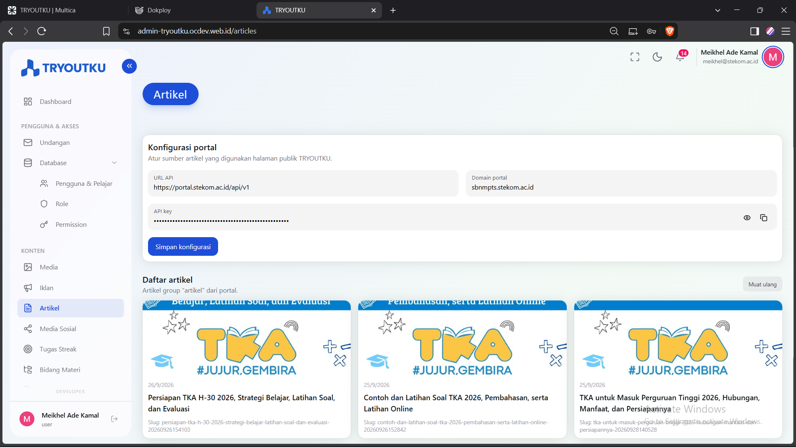 | 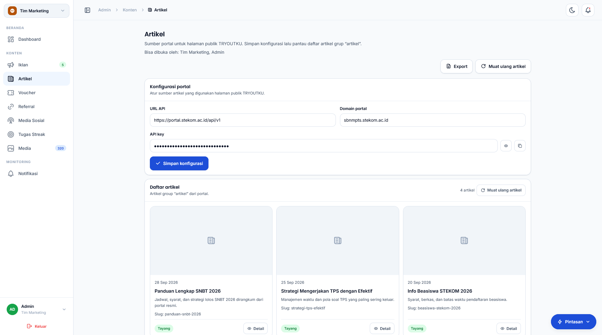 |

## Bank Soal

* Dulu: satu tabel (Konten, Materi, Status, Aksi) berisi judul soal terpotong.
* Sekarang dua tingkat: grid mata pelajaran, lalu soal-soal mata pelajaran itu sebagai kartu.
* Tiap kartu soal: nomor, tipe, topik, tingkat sulit, status, teks soal, gambar, pilihan jawaban, kunci + pembahasan, dan aksi Ubah / Duplikat / Arsipkan.
* Kepala kartu memakai kontrol yang sama dengan tabel: Filter, Urutkan, Export, Reset.

| Before | Update |
|---|---|
| 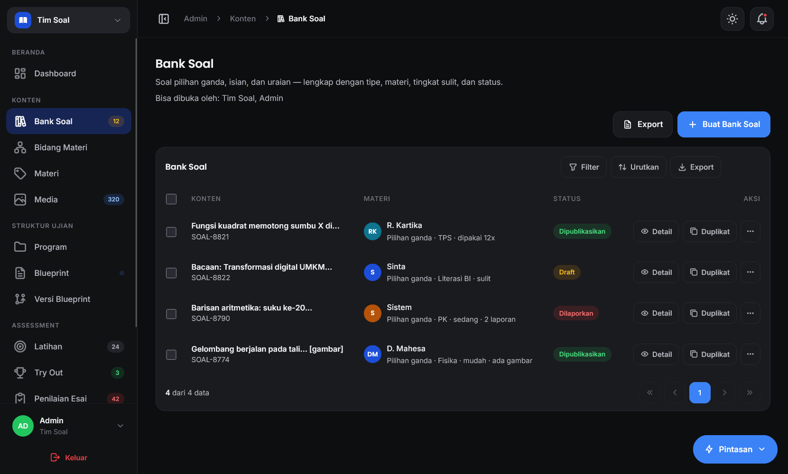 | 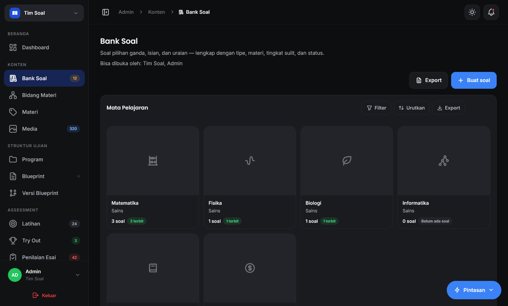 |

Soal terkait per mata pelajaran:

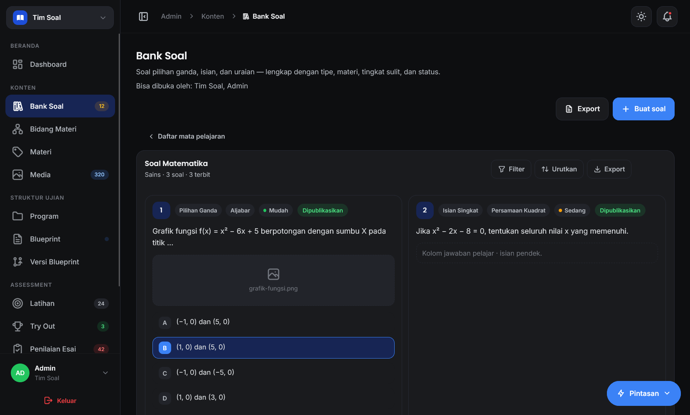

## Dashboard

* Halaman baru, tidak ada di admin lama.
* Halo Marketing, 3 KPI, Tugas Streak, Kanal aktif, Artikel portal, Perlu perhatian, Aktivitas terbaru.

| Before | Update |
|---|---|
| *(kosong)* | 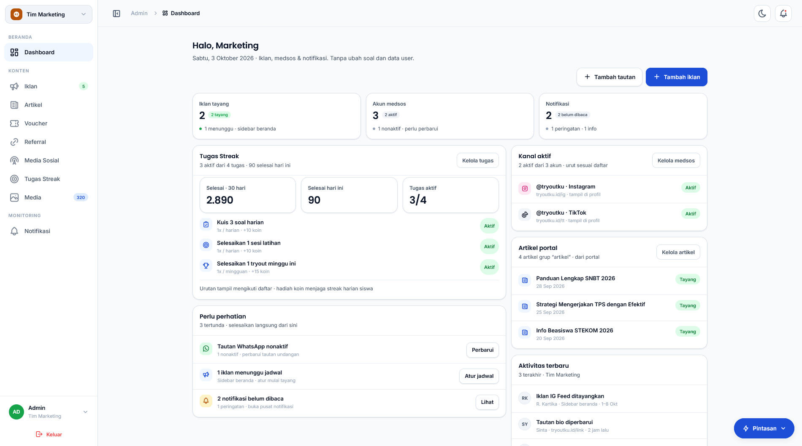 |

## Iklan

* Dulu: workspace dengan 3 angka ringkasan + 1 kartu contoh.
* Sekarang: filter chip + pencarian + kartu per iklan.
* Tiap kartu: jadwal Mulai/Selesai, ubah status dari dropdown, Ubah, Duplikat, Hapus (ada Urungkan).

| Before | Update |
|---|---|
| 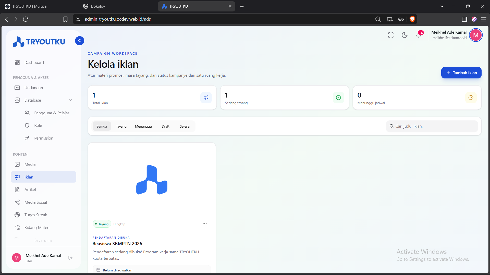 | 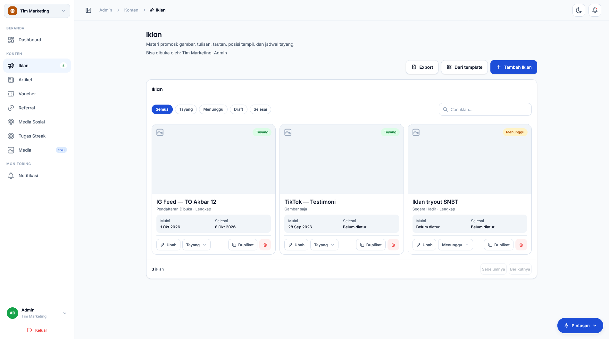 |

## Media

* Dulu: tabel (ID, preview, nama file, tipe, ukuran, tanggal, aksi).
* Sekarang: grid tile dengan chip tipe + pencarian + export per tile.

| Before | Update |
|---|---|
| 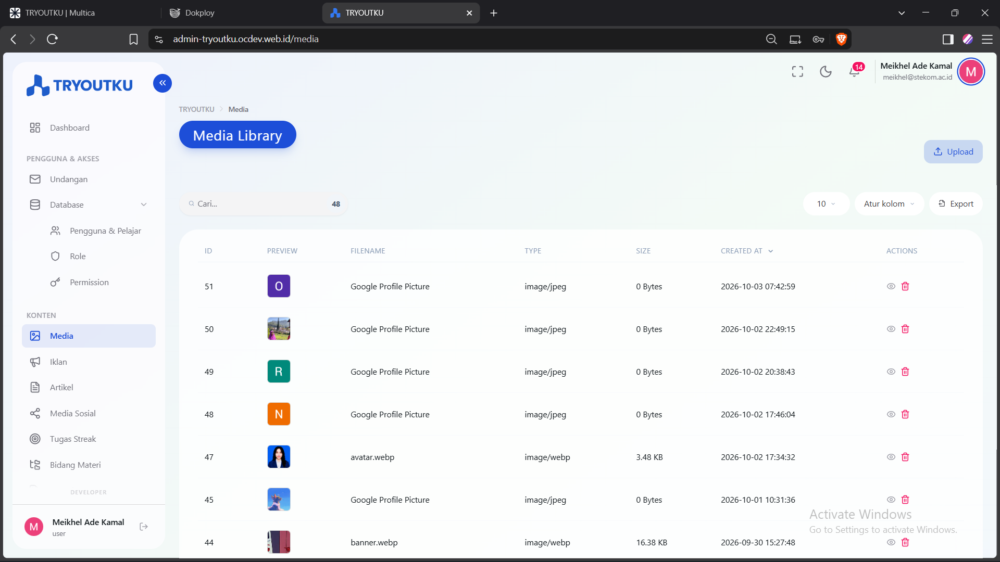 | 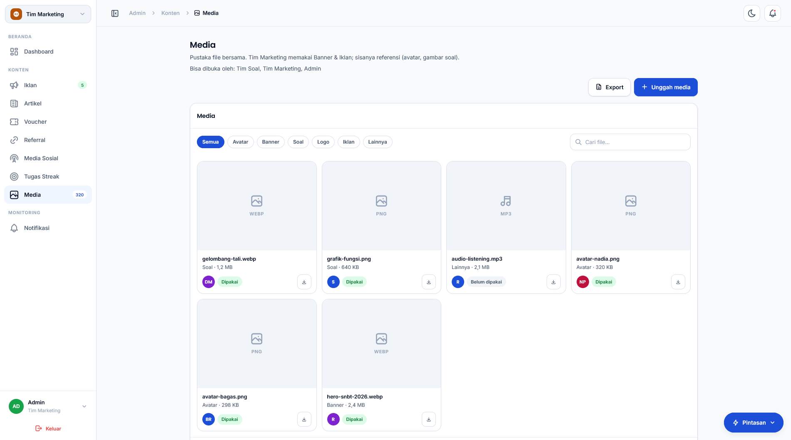 |

## Media Sosial

* Dulu: tabel dengan aksi teks (Edit, Nonaktifkan, Naik, Turun, Hapus).
* Sekarang: daftar geser untuk urutan tampil, status pill, tombol ikon, plus kartu Pratinjau tautan.

| Before | Update |
|---|---|
| 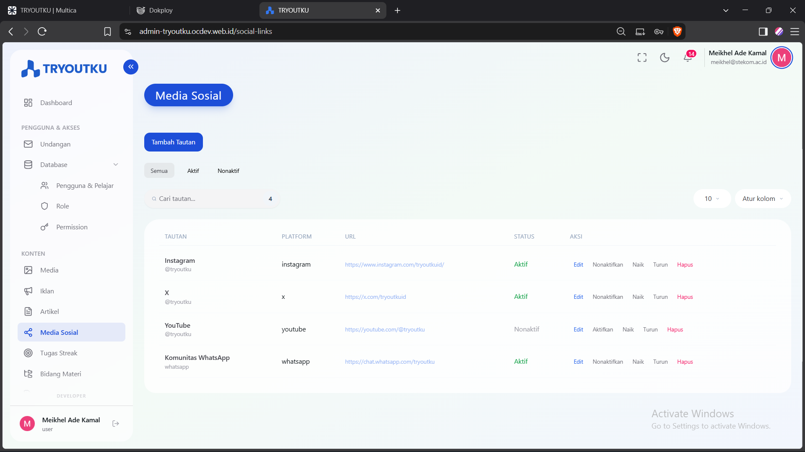 | 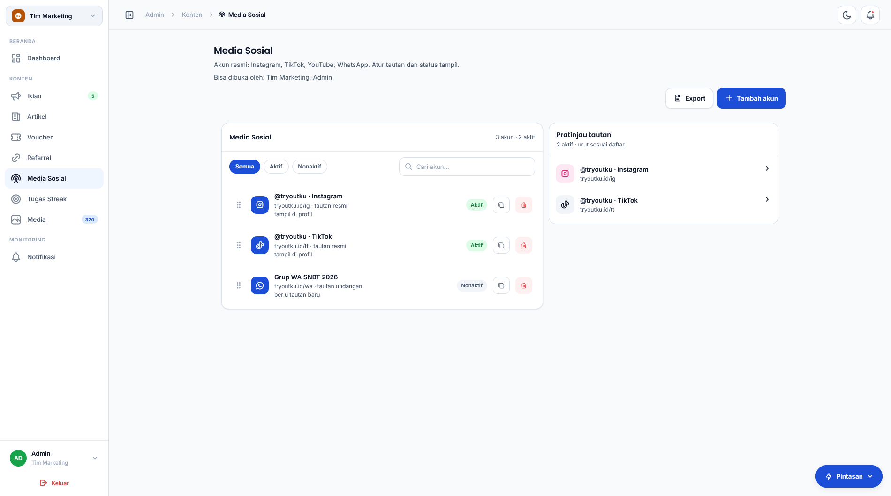 |

## Notifikasi

* Halaman baru, tidak ada di admin lama.
* Daftar belum/sudah dibaca + Tandai semua dibaca.

| Before | Update |
|---|---|
| *(kosong)* | 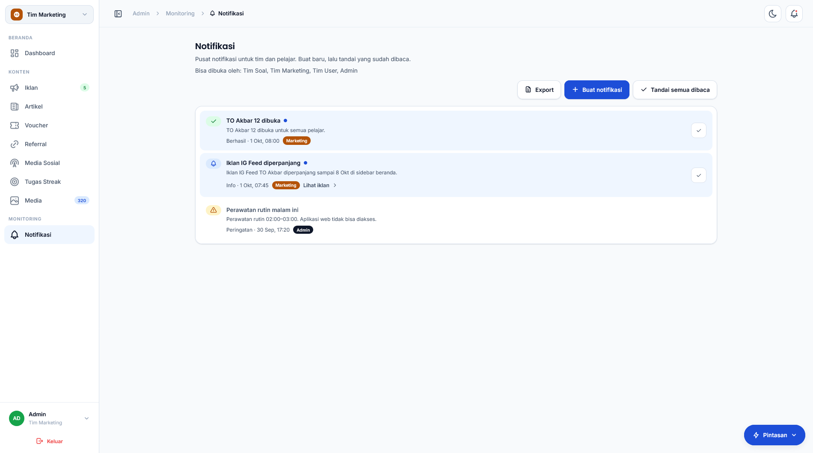 |

## Pengaturan

* Halaman baru, tidak ada di admin lama.
* Mode Terang/Gelap, notifikasi, pasang aplikasi, export, cadangan, reset lokal.

| Before | Update |
|---|---|
| *(kosong)* | 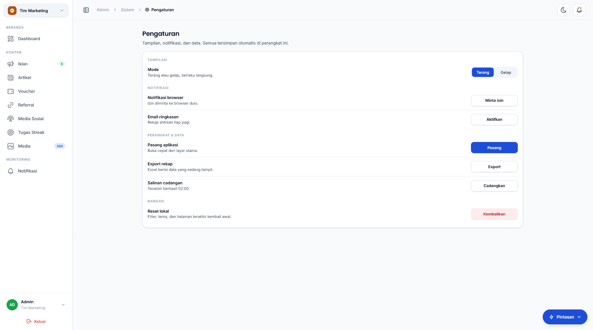 |

## Profil

* Halaman baru, tidak ada di admin lama.
* Data diri + daftar halaman yang boleh dibuka peran ini.

| Before | Update |
|---|---|
| *(kosong)* | 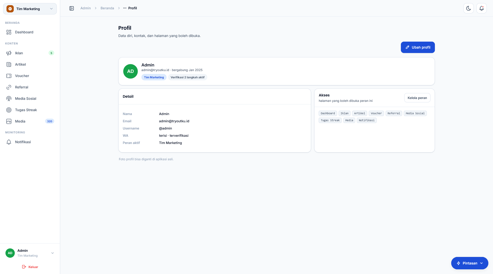 |

## Referral

* Fitur baru, tidak ada di admin lama.
* Model quest: admin kelola Quest A/B/C (multi-live, toggle Aktif/Nonaktif), siswa yang membuat tautan.
* Quest cards di atas tabel: badge Quest A (blue) / B (purple) / C (amber), reward split +pengajak / +pendaftar (10–15 koin, ikut ekonomi student app: latihan +10, TO +15), periode Berlaku.
* Tabel campuran Quest / Kuota / Penyebar / Pendaftar tanpa kolom Aksi (sortable Quest, Penyebar). Kolom Quest pertama. Kolom Penyebar: nama + ikon kalender tanggal + pil koin per pendaftar (ikon `coin.png` dari student app). Kolom Pendaftar: nama + koin pendaftar (ikut reward quest, ikon `coin.png`). Kolom Kuota: N/M pendaftar (tanpa total, tanpa expand). Penyebar dan Pendaftar selalu sama lebar (`table-layout:fixed`). Detail lewat klik baris.
* Baris Filter / Urutkan / Export di semua tabel: tombol Reset yang tersembunyi tidak lagi menyisakan gap (`display:none`), dan grup tombol mengisi ruang secara flex + wrap.
* Kartu quest: tombol Ubah + Aktifkan/Nonaktifkan di bawah baris tanggal Berlaku.
* Strip Minta Undangan (Marketing saja) di atas quest: butuh undangan sekolah → minta via Tim User, tanpa halaman mandiri.
* Aksi: Detail + Cabut (ada Urungkan). Drawer Ringkasan: penyebar, pendaftar unik, koin per pendaftar, quest, tanggal dibuat + Salin tautan.
* Chip: Semua / Aktif / Penuh / Kedaluwarsa. Tidak ada Tambah cepat / Buat referral (toast: tautan dibuat siswa dari quest yang live).
* Satu siswa satu reward. Share berkali-kali tetap dihitung 1.

| Before | Update |
|---|---|
| *(kosong)* | 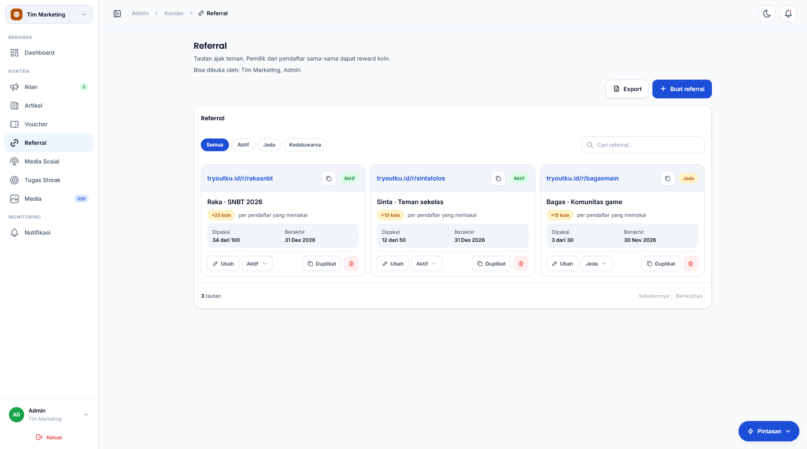 |

## Tugas Streak

* Dulu: monitoring nol + tabel urutan.
* Sekarang: kartu Monitoring Tugas (7/30/90 hari) + kartu geser dengan alur Tinjau & terbitkan.

| Before | Update |
|---|---|
| 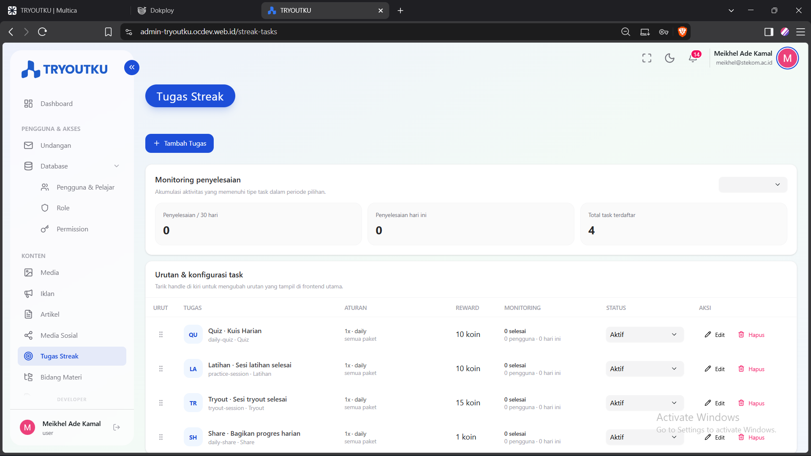 | 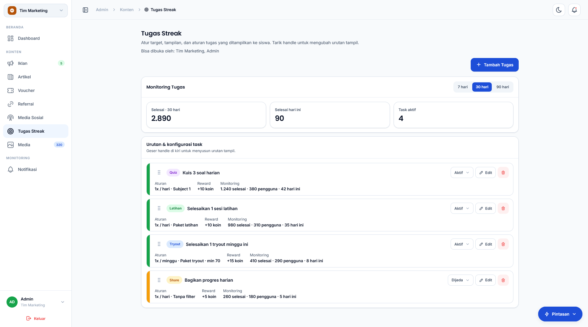 |

## Voucher

* Fitur baru, tidak ada di admin lama.
* Kartu model tiket: header VOUCHER + status, kode mono + salin, garis perforasi, stat berlabel Nilai / Terpakai + bar / Berlaku / Penerima.
* Koin-only: Nilai N koin (validasi 1–32767), tanpa Persen/Nominal. Penerima: Semua / Acak / Pilihan.
* Auto-urutan: Aktif, Siap, Draft, Kedaluwarsa. Alur Draft → Siap → Aktif → Kedaluwarsa.
* Ada Tambah cepat (cukup nama: otomatis 10 koin, kuota 100, semua pelajar) dan form lengkap.

| Before | Update |
|---|---|
| *(kosong)* | 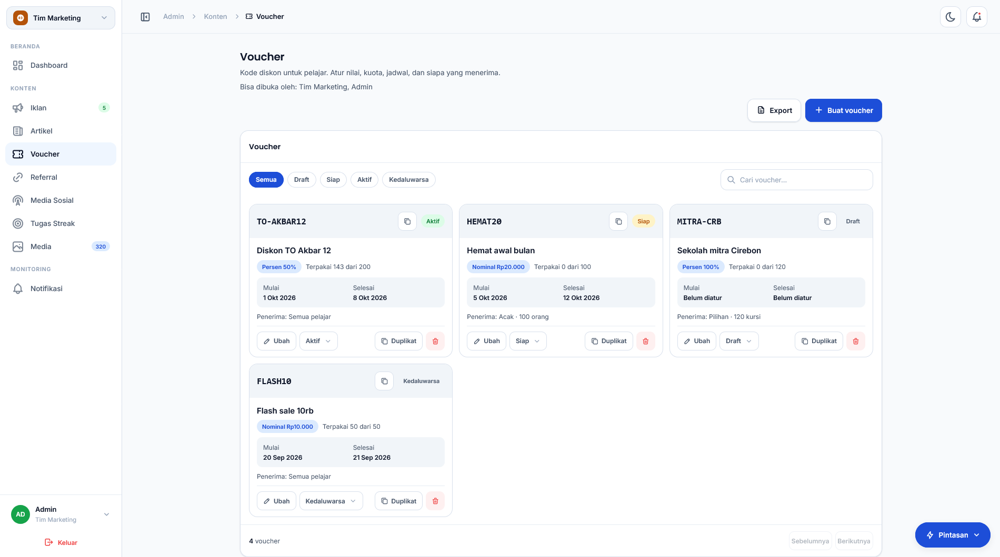 |

## Undangan (split Marketing ↔ Tim User)

* Baru di PR ini, tidak ada di admin lama maupun perbandingan sebelumnya.
* Marketing: strip Minta Undangan di halaman Referral (maks 5 permintaan terbuka, hanya Marketing yang bisa meminta). Form: Email tujuan, Penjelasan singkat (`user baru mendapatkan benefit +10 koin Quest A`). Benefit selalu Quest A (pengguna baru), tanpa dropdown. Tidak ada halaman / menu mandiri.
* Kolom Aksi disembunyikan di tabel yang aksinya non-fungsional (Undangan, Data Pelajar, Izin, Materi, Universitas, Jenjang, Prodi, Versi Blueprint, Try Out, Penilaian Esai, Log, Masukan, Testimoni, Tugas Streak, Referral). Detail tetap via klik baris; tabel dengan navigasi nyata (Pengguna, Peran, Bidang, Program, Blueprint, Latihan, Laporan Soal) tetap punya Aksi.
* Tim User: halaman `Undangan` + section `Permintaan dari Marketing` (Setujui / Tolak di tempat). Setujui → `INV-xxx` tercatat di Undangan + notif link ke `invitations`. Tolak wajib alasan.
* Label quest live ikut tersemat di Undangan (`· Quest A, …`) via `syncInvQuest`.

| Before | Update |
|---|---|
| *(kosong)* | *(screenshot menyusul)* |

Catatan: screenshot diambil sebelum tombol Tambah cepat ada dan sebelum model quest/tiket/split undangan. Referral tidak lagi punya Tambah cepat / Buat referral; Voucher masih punya Tambah cepat. Screenshot `after-referral.png`, `after-voucher.png` perlu diambil ulang, plus screenshot baru untuk Undangan split.
